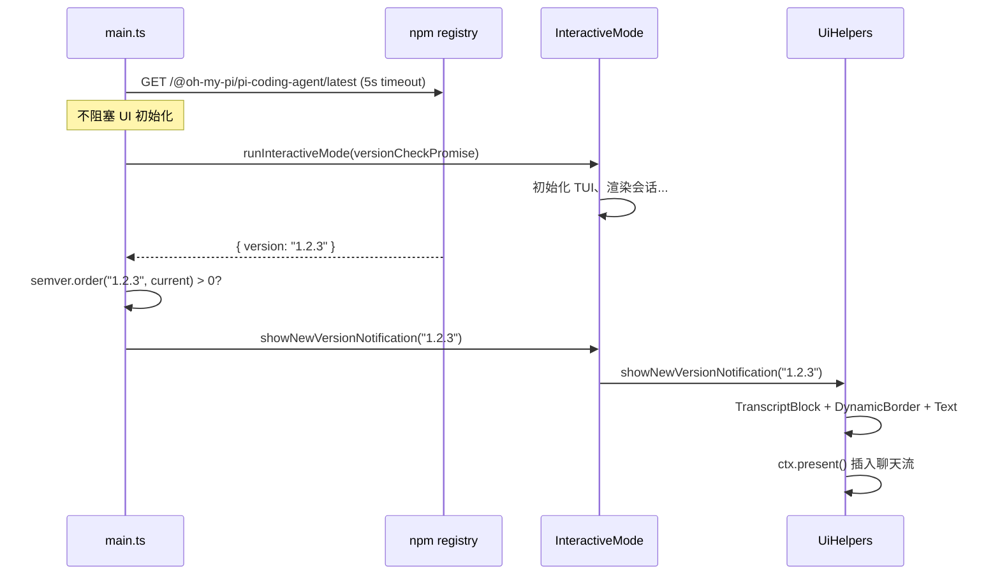

# TUI "Update Available" 显示逻辑

## 概述

omp 在 interactive 模式下启动时，异步查询 npm registry 检查是否有新版本。若有更新，在 TUI 聊天流中插入一条 warning 色的通知卡片。

## 完整调用链

```
runRootCommand()                                    # main.ts:1511
  └─ checkForNewVersion(VERSION)                    # main.ts:105 — 启动时立即触发，不阻塞
       ├─ settings.get("startup.checkUpdate")       # 设置关闭则直接返回
       ├─ fetch npm registry /latest                # 5s 超时
       └─ Bun.semver.order(latest, current) > 0     # 语义化版本比较
            └─ 返回 newVersion | undefined
  └─ runInteractiveMode(..., versionCheckPromise)
       └─ versionCheckPromise.then(...)             # main.ts:461 — Promise resolve 后回调
            ├─ settings.get("startup.checkUpdate")  # 二次守卫
            └─ mode.showNewVersionNotification(v)
                 └─ InteractiveMode                 # interactive-mode.ts:3920
                      └─ UiHelpers                  # ui-helpers.ts:707
                           ├─ TranscriptBlock       # 插入到聊天流
                           ├─ DynamicBorder         # warning 色上下边框
                           └─ Text("Update Available" + 版本号 + "omp update")
```

## 各层详解

### 1. 版本检查 — `checkForNewVersion()`

文件：`packages/coding-agent/src/main.ts:105-126`

```ts
async function checkForNewVersion(currentVersion: string): Promise<string | undefined> {
    if (!settings.get("startup.checkUpdate")) return;

    try {
        const response = await fetch(
            "https://registry.npmjs.org/@oh-my-pi/pi-coding-agent/latest",
            { signal: withTimeoutSignal(5_000) }
        );
        if (!response.ok) return undefined;

        const data = await response.json();
        const latestVersion = data.version;

        if (latestVersion && Bun.semver.order(latestVersion, currentVersion) > 0) {
            return latestVersion;
        }
        return undefined;
    } catch {
        return undefined;
    }
}
```

**要点：**

| 项目 | 说明 |
|---|---|
| 数据源 | `https://registry.npmjs.org/@oh-my-pi/pi-coding-agent/latest` |
| 超时 | 5 秒（`withTimeoutSignal`） |
| 比较 | `Bun.semver.order`，仅当 `latest > current` 才通知 |
| 容错 | 网络错误、非 2xx 状态码、解析失败 → 全部静默返回 `undefined` |
| 触发条件 | 仅 interactive 模式（`--print` / `--rpc` / `--acp` 不触发） |

### 2. 触发时机

文件：`packages/coding-agent/src/main.ts`

- **启动阶段** (line 1511)：`checkForNewVersion(VERSION)` 立即调用，返回 Promise，不阻塞 UI
- **resolve 阶段** (line 461-470)：在 `runInteractiveMode` 内部注册 `.then()`，结果返回后再渲染通知

```ts
// line 1511 — 启动时立即发起，不阻塞
const versionCheckPromise = checkForNewVersion(VERSION).catch(() => undefined);

// line 461-470 — 异步回调
versionCheckPromise
    .then(newVersion => {
        if (!settings.get("startup.checkUpdate")) return;  // 二次守卫
        if (newVersion) {
            mode.showNewVersionNotification(newVersion);
        }
    })
    .catch(() => {});
```

**设计意图：**
- 两次检查 `startup.checkUpdate`：启动时短路 + resolve 时再确认（防止启动后用户通过 `/config` 改了设置）
- catch 兜底，确保任何异常不抛到顶层

### 3. TUI 渲染

文件：`packages/coding-agent/src/modes/utils/ui-helpers.ts:707-722`

```ts
showNewVersionNotification(newVersion: string): void {
    const block = new TranscriptBlock();
    block.addChild(new DynamicBorder(text => theme.fg("warning", text)));
    block.addChild(
        new Text(
            theme.bold(theme.fg("warning", "Update Available")) +
                "\n" +
                theme.fg("muted", `New version ${newVersion} is available. Run: `) +
                theme.fg("accent", "omp update"),
            1,
            0,
        ),
    );
    block.addChild(new DynamicBorder(text => theme.fg("warning", text)));
    this.ctx.present(block);
}
```

**渲染效果：**

```
┌─────────────────────────────────────────────┐
│  Update Available                           │  ← bold + warning 色
│  New version 1.2.3 is available. Run:       │  ← muted 色
│  omp update                                 │  ← accent 色
└─────────────────────────────────────────────┘
```

**渲染细节：**

| 元素 | TUI 组件 | 主题色 |
|---|---|---|
| 上边框 | `DynamicBorder` | `warning` |
| 标题 "Update Available" | `Text` bold | `warning` |
| 版本号 + 提示文字 | `Text` | `muted` |
| 命令 `omp update` | `Text` | `accent` |
| 下边框 | `DynamicBorder` | `warning` |

- 以 `TranscriptBlock` 形式插入聊天流底部，表现为一条系统消息
- `DynamicBorder` 根据实际文本宽度自动撑开
- 通过 `this.ctx.present(block)` 追加，而不是走 stdout

### 4. 设置开关

| 设置路径 | 类型 | 默认值 | UI 分组 |
|---|---|---|---|
| `startup.checkUpdate` | `boolean` | `true` | interaction → Startup & Updates |

```ts
// 定义位置：packages/coding-agent/src/config/settings-schema.ts:1640
"startup.checkUpdate": {
    type: "boolean",
    default: true,
    ui: {
        tab: "interaction",
        group: "Startup & Updates",
        label: "Check for Updates",
        description: "Check for omp updates on startup",
    },
},
```

用户可通过以下方式关闭：

- `/config` 交互式配置面板
- `settings.yml` 中写入 `startup.checkUpdate: false`

## 时序图



## 与其他更新机制的区别

omp 有三套独立的更新检测，互不干扰：

| 机制 | 目标 | 触发方式 |
|---|---|---|
| `startup.checkUpdate` (本文) | omp 自身 CLI | 启动时异步 npm 查询 |
| `marketplace.autoUpdate` | 插件更新 | `MarketplaceAutoUpdate.start()` |
| `omp update` 命令 | omp 自身 CLI | 用户手动触发 |

本文只涉及第一项。
