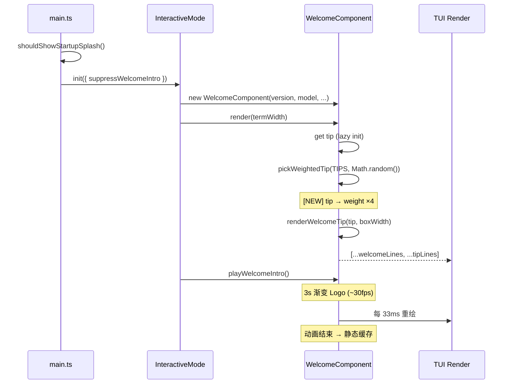

# TUI 启动界面 Tips 显示逻辑

## 概述

omp interactive 模式启动时，Welcome 界面底部会随机展示一条操作提示（Tip）。Tips 内容来自编译时嵌入的 `tips.txt`，优先展示标记 `[NEW]` 的内容，并支持彩虹动画特效。

---

## 整体架构

```
runRootCommand()                          # main.ts:1444
  └─ shouldShowStartupSplash()           # startup-splash.ts — 决定是否放动画
  └─ runInteractiveMode(...)
       └─ mode.init({ suppressWelcomeIntro })
            └─ InteractiveMode.init()     # interactive-mode.ts:885-901
                 ├─ new WelcomeComponent(version, model, provider, sessions, lsp)
                 ├─ playWelcomeIntro()   # 3 秒渐变 Logo 动画
                 └─ WelcomeComponent.render()
                      ├─ 双列布局（左：Logo + 模型；右：提示 + LSP + 历史）
                      └─ #renderTip(boxWidth)
                           └─ this.tip (getter)
                                └─ pickWeightedTip(TIPS, Math.random())
                                     └─ renderWelcomeTip(tip, boxWidth, phase)
```

## 各层详解

### 1. Tips 数据源 — `tips.txt`

文件：`packages/coding-agent/src/modes/components/tips.txt`

- 编译时通过 `import tipsText from "./tips.txt" with { type: "text" }` 内联
- 每行一条 tip，空行自动过滤
- 行末 `[NEW]` 标记表示新增提示，渲染时替换为彩虹 "NEW!" 标签

```ts
const TIPS: readonly string[] = tipsText
    .split("\n")
    .map(line => line.trim())
    .filter(line => line.length > 0);
```

当前共 **25 条** tips，涵盖 slash 命令、快捷键、高级功能等。

### 2. Tip 选取 — `pickWeightedTip()`

文件：`welcome.ts:50-60`

```ts
export function pickWeightedTip(tips: readonly string[], r: number): string {
    if (tips.length === 0) return "";
    const weights = tips.map(tip => (NEW_TIP_MARKER.test(tip) ? NEW_TIP_WEIGHT : 1));
    const total = weights.reduce((sum, w) => sum + w, 0);
    let acc = r * total;
    for (let i = 0; i < tips.length; i++) {
        acc -= weights[i] ?? 1;
        if (acc < 0) return tips[i] ?? "";
    }
    return tips[tips.length - 1] ?? "";
}
```

**加权随机选择：**

| 标记 | 权重 | 说明 |
|---|---|---|
| 普通 tip | 1 | 均匀概率 |
| `[NEW]` tip | **4** | 新增提示曝光率 ×4 |

- `r` 为调用方传入的 `[0, 1)` 均匀随机数
- 实现为加权累积分布抽样

### 3. Tip 选取触发 — `WelcomeComponent.tip` getter

文件：`welcome.ts:162-172`

```ts
get tip(): string | undefined {
    if (this.#selectedTip === undefined) {
        if (theme.getSymbolPreset() === "unicode" && Math.random() < 0.1) {
            this.#selectedTip = "Please use nerdfont 😭.";
        } else {
            this.#selectedTip = pickWeightedTip(TIPS, Math.random());
        }
    }
    return this.#selectedTip || undefined;
}
```

**选取策略：**
- **懒初始化**：首次访问时才选取，结果缓存于 `#selectedTip`
- **彩蛋**：unicode 模式下有 10% 概率展示 `"Please use nerdfont 😭."`（nerdfont 模式可渲染更丰富的符号/图标）
- **实例级缓存**：同一个 `WelcomeComponent` 实例始终展示同一条 tip

### 4. Tip 渲染 — `renderWelcomeTip()`

文件：`welcome.ts:85-125`

```ts
export function renderWelcomeTip(tip: string, boxWidth: number, phase = 0): string[] {
    const label = "Tip: ";
    const labelWidth = visibleWidth(label);
    const bodyBudget = boxWidth - 1 - labelWidth;  // 1 = 缩进
    if (bodyBudget < 8) return [];                 // 太窄不渲染

    const isNew = NEW_TIP_MARKER.test(tip);
    const body = isNew ? tip.replace(NEW_TIP_MARKER, "") : tip;

    const wrappedBody = wrapTextWithAnsi(replaceTabs(body), bodyBudget);
    if (wrappedBody.length === 0) return [];

    const continuationIndent = padding(labelWidth);
    const styledLabel = theme.fg("customMessageLabel", label);

    const lines = wrappedBody.map((line, index) => {
        const styledBody = theme.fg("muted", line);
        const content = index === 0
            ? `${styledLabel}${styledBody}`
            : `${continuationIndent}${styledBody}`;
        return ` ${theme.italic(content)}`;
    });

    // [NEW] tag: 彩虹 "NEW!" 追加到行尾
    if (isNew) {
        const tag = renderNewTag(phase, encoding);
        const lastLine = lines[lines.length - 1];
        if (lastLine && visibleWidth(lastLine) + tagWidth <= boxWidth) {
            lines[lines.length - 1] = `${lastLine} ${tag}`;
        } else {
            lines.push(` ${continuationIndent}${tag}`);
        }
    }
    return lines;
}
```

**渲染效果示意：**

```
 Tip: Press ctrl+r to search your prompt history and reuse a past message
```

带 `[NEW]` 标记时：

```
 Tip: Pair up live: /collab shares your session through...  NEW!  ← 彩虹闪烁
```

**样式细节：**

| 元素 | 样式 |
|---|---|
| `"Tip: "` 前缀 | `customMessageLabel` 色，斜体 |
| Tip 正文 | `muted` 色，斜体 |
| 换行续行 | `padding(labelWidth)` 缩进对齐 |
| `NEW!` 标签 | bold + HSL 彩虹渐变 (`hsl(phase*360, 95%, 60%)`) |
| 最小宽度 | `< 8` 字符宽度时不渲染 |

### 5. 彩虹 "NEW!" 动画 — `renderNewTag()`

文件：`welcome.ts:67-84`

```ts
function renderNewTag(phase: number, encoding: ColorEncoding): string {
    const chars = [..."NEW!"];
    let out = "\x1b[1m";  // bold
    for (let i = 0; i < chars.length; i++) {
        const hue = Math.round(((i / chars.length + (phase % 1)) % 1) * 360);
        const color = Bun.color(`hsl(${hue}, 95%, 60%)`, encoding);
        out += color + chars[i];
    }
    return out + "\x1b[0m";
}
```

- 每个字符独立 HSL 着色，从左到右色相偏移
- `phase` 随时间旋转色相周期：`performance.now() / 1500ms`
- Welcome intro 期间（3 秒）phase 持续变化 → **动画闪烁效果**
- Intro 结束后渲染缓存，phase 固定 → **静态彩虹**

### 6. Welcome 界面整体布局

文件：`welcome.ts:228-400`

```
┌─ omp v1.0.0 ──────────────────────────────────────┐
│                                                    │
│           Welcome back!          │ Tips             │
│                                  │ # for prompt...  │
│        ▀██████████▀              │ / for commands   │
│         ╘██    ██                │ ! to run bash    │
│          ██    ██                │ $ to run python  │
│          ██    ██                │ ──────────────── │
│         ▄██▄  ▄██▄               │ LSP Servers      │
│                                  │ ✓ typescript ts  │
│        claude-sonnet-4-5         │ ✓ rust-analyzer  │
│        anthropic                 │                  │
│                                  │ ──────────────── │
│                                  │ Recent sessions  │
│                                  │ • fix-auth...    │
│                                  │ • add-tests...   │
└──────────────────────────────────┴─────────────────┘
 Tip: Press ctrl+r to search your prompt history...   ← Tips 行在盒子下方
```

**布局参数：**

| 参数 | 值 |
|---|---|
| 最大宽度 | 100 列 |
| 左列默认 | 26 列（最小 12，按内容自适应） |
| 右列最小 | 20 列 |
| 历史会话槽 | 固定 4 行 |
| LSP 服务槽 | 固定 4 行 |

### 7. Welcome Intro 动画

文件：`welcome.ts:180-205`

```ts
playIntro(requestRender: () => void): void {
    this.#animStart = performance.now();
    this.#animTimer = setInterval(() => {
        if (performance.now() - this.#animStart >= INTRO_MS) {
            this.#stopAnimation();   // 3 秒后停止
        }
        requestRender();              // ~30fps 重绘
    }, INTRO_TICK_MS);               // 33ms 间隔
}
```

| 参数 | 值 | 说明 |
|---|---|---|
| `INTRO_MS` | 3000ms | 动画总时长 |
| `INTRO_TICK_MS` | 33ms | 重绘间隔 (~30fps) |
| `INTRO_SWEEPS` | 2.5 | 渐变相位旋转圈数 |
| `INTRO_SHINE_TRAVERSALS` | 3 | 高光扫过次数 |

动画期间 Logo 使用 `gradientLogo()` 渲染为多色渐变 + 扫光效果。动画结束切换为静态渐变的 `REST_FRAME`。

### 8. Welcome 界面何时显示/跳过

**`suppressWelcomeIntro` 的计算**（`main.ts:446-449`）：

```ts
const playStartupSplash = showStartupSplash && setupScenes.length === 0;
await mode.init({
    suppressWelcomeIntro: resuming || setupScenes.length > 0 || playStartupSplash,
    clearInitialTerminalHistory: true,
});
```

**三种情况下跳过 Welcome intro：**

| 条件 | 说明 |
|---|---|
| `resuming` | `--continue` / `--resume` / `--fork` 时 |
| `setupScenes.length > 0` | 有 Setup Wizard 场景要跑 |
| `playStartupSplash` | 启用了启动 SPLASH 动画 |

**`shouldShowStartupSplash()`**（`startup-splash.ts`）：

```ts
export function shouldShowStartupSplash(options): boolean {
    if (!options.configured) return false;        // startup.showSplash = false
    if (!options.isInteractive) return false;     // 非 interactive
    if (options.resuming || options.quiet) return false;
    if (options.timing) return false;             // PI_TIMING 模式
    return options.stdinIsTTY && options.stdoutIsTTY;  // 必须 TTY
}
```

> **注意**：即使 Welcome intro 被跳过，`WelcomeComponent` 仍会渲染（只是不播 3 秒动画），Tips 始终显示。

---

## 时序图



---

## 关键文件索引

| 文件 | 职责 |
|---|---|
| `modes/components/tips.txt` | Tips 原始文本（25 条） |
| `modes/components/welcome.ts` | Welcome 组件：渲染、Tip 选取、动画 |
| `modes/interactive-mode.ts` | 初始化 Welcome 组件、触发 intro |
| `main.ts:444-449` | 决定 `suppressWelcomeIntro` |
| `startup-splash.ts` | 决定是否显示 SPLASH |
| `config/settings-schema.ts` | `startup.showSplash` 配置项 |

---

## 扩展指南

- **新增 tip**：在 `tips.txt` 末尾添加一行，行末加 `[NEW]` 可获得 ×4 曝光加成
- **调整 NEW 曝光权重**：修改 `welcome.ts:45` 的 `NEW_TIP_WEIGHT` 常量
- **修改动画参数**：修改 `welcome.ts:550-557` 的 `INTRO_*` 常量
- **关闭 Welcome**：`settings.yml` 设置 `startup.showSplash: false`（注意：这只会跳过 splash 动画，Welcome 界面仍显示；要完全跳过 Welcome intro 动画需 `--continue` 或有 setup wizard）
